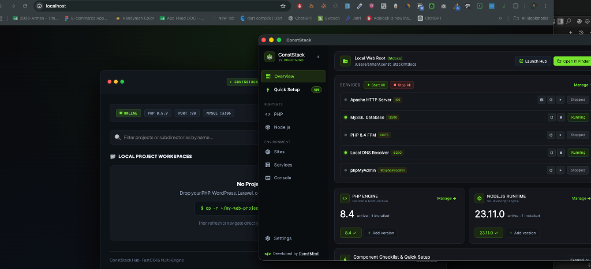

<div align="center">

# ⚡ ConstStack
### The Ultra-Fast, Zero-Config Local Web Development Environment for macOS & Windows
**Engineered by ConstMind**

[](https://github.com/ArmanKT/ConstStack-releases/releases/latest)
[](https://github.com/ArmanKT/ConstStack-releases/releases/latest)
[](https://github.com/ArmanKT/ConstStack-releases/releases/latest)
[](https://constmind.com)

<br/>



<br/><br/>

[🚀 **1-Line Quick Install**](#-quick-installation) • [🍺 **Homebrew Cask**](#-method-2-homebrew-cask) • [📥 **Download DMG**](#-method-3-manual-dmg-download) • [✨ **Features**](#-features) • [🌐 **Official Website**](https://constmind.com)

</div>

---

## 📖 Overview

**ConstStack** is a next-generation desktop development environment built for modern web developers. It provides a lightning-fast native stack combining **Apache 2.4, PHP-FPM Multi-Version Engine (PHP 7.4 - 8.5), Node.js Runtime Manager, MySQL 8.x, and phpMyAdmin** with zero configuration required.

Say goodbye to slow, bloated legacy tools like XAMPP or complex virtual machines. ConstStack runs natively with near-zero memory footprint, dedicated port isolation, automated system self-healing doctor, and zero ghost processes.

---

## 🚀 Quick Installation

### ⚡ Method 1: 1-Line Terminal Auto-Install (Recommended)
Automatically downloads the latest release, installs into `/Applications`, removes Apple quarantine, and bypasses Gatekeeper restrictions with zero friction:

```bash
curl -fsSL https://raw.githubusercontent.com/ArmanKT/ConstStack-releases/main/install.sh | bash
```

---

### 🍺 Method 2: Homebrew Cask
If you use Homebrew, you can install ConstStack directly via our tap:

```bash
brew tap armankt/conststack https://github.com/ArmanKT/ConstStack
brew install --cask conststack
```

---

### 📥 Method 3: Manual DMG Download

1. Download **[`ConstStack-macOS-v1.0.0.dmg`](https://github.com/ArmanKT/ConstStack-releases/releases/latest)** directly from this repository.
2. Open the `.dmg` and drag **ConstStack** into your **Applications** folder.
3. If macOS shows *"Apple cannot check it for malicious software"* (Gatekeeper block), run this 1-line command in your terminal to unlock it:

```bash
xattr -cr /Applications/ConstStack.app
```
*Or simply **Right-Click (Control-Click)** on `ConstStack.app` in Finder ➜ Click **Open** ➜ Click **Open**.*

---

## ✨ Features

### ⚡ Lightning-Fast Native Stack
* **Native Apache 2.4**: Embedded high-throughput HTTP server with `mod_proxy_fcgi` support.
* **1-Click Port 80 & 443 Support**: Bind natively to standard HTTP port 80 with native macOS Touch ID authorization and zero password prompts on reboot.
* **Strict Port Isolation**: Seamlessly switch between Port 80, 8080, 3000, and 8000 with zero ghost processes or socket collisions.

### 🐘 Multi-Version PHP Engine & Extensions
* Instant switching between **PHP 8.5, 8.4, 8.3, 8.2, 8.1, and 7.4**.
* **Extensions Manager**: 1-click driver installation & driver verification for `mysqli`, `pdo_mysql`, `curl`, `mbstring`, `intl`, `gd`, and `redis`.
* **CLI Sync**: Automatically symlinks `php`, `composer`, and runtime binaries so `php -v` in your terminal always matches your active ConstStack engine.

### 🟢 Node.js & NPM Package Manager
* Built-in Node.js version manager supporting **Node 24, 23, 22 (LTS), 20 (LTS), and 18**.
* 1-Click **"Set as Active"** and terminal PATH integration (`~/.const_stack/bin/node`, `npm`, `npx`).

### 🩺 Server Doctor & Auto-Troubleshooter
* Automated self-healing engine that tests ports, resets stale FastCGI locks, recovers database sockets, and restarts all daemons cleanly in 1 click.

### 🗄️ Database & phpMyAdmin
* **Native MySQL 8.x Daemon**: Pre-configured with optimized buffer pools and local socket communication (`/tmp/mysql.sock`).
* **phpMyAdmin 5.2.3 Native Hub**: Built-in 1-click database management accessible natively via `http://localhost:8080/phpmyadmin`.

### 🌐 Local Domain Resolution (*.test)
* Built-in local DNS responder (`:5390`) that automatically maps any `.test` or custom virtual host domain to `127.0.0.1` without editing `/etc/hosts` manually.

---

## 📊 ConstStack vs Legacy Dev Environments

| Feature | ⚡ ConstStack | 🐢 XAMPP | 🐑 Laravel Herd | 🐘 MAMP |
| :--- | :---: | :---: | :---: | :---: |
| **Startup Speed** | **< 1 sec** | 5 - 10 sec | 2 - 3 sec | 8 - 15 sec |
| **Memory Footprint** | **~40 MB** | ~250 MB | ~120 MB | ~300 MB |
| **Port 80 One-Touch Auth** | ✅ **Yes** | ❌ Manual | ✅ macOS Only | ❌ Manual |
| **Multi-PHP Project Routing** | ✅ **Yes** | ❌ Single PHP | ✅ Paid Pro Only | ❌ Paid Pro Only |
| **Node.js & NPM Manager** | ✅ **Built-in** | ❌ None | ❌ None | ❌ None |
| **Self-Healing Doctor** | ✅ **1-Click** | ❌ None | ❌ None | ❌ None |
| **phpMyAdmin Integration** | ✅ **Included** | ✅ Included | ❌ None | ✅ Included |

---

## ⚙️ Default System Paths

ConstStack keeps all files neatly organized in your home directory without cluttering system directories:

* **Base Data Directory**: `~/.const_stack/`
* **Local Web Root (htdocs)**: `~/.const_stack/htdocs/`
* **Runtime Binaries**: `~/.const_stack/runtimes/`
* **CLI Symlinks**: `~/.const_stack/bin/` (auto-added to `$PATH`)
* **Logs Directory**: `~/.const_stack/logs/`

---

## 🛠️ System Requirements

* **macOS**: macOS 12.0 (Monterey) or later (Apple Silicon M1/M2/M3/M4 & Intel 64-bit).
* **Windows**: Windows 10 / 11 (64-bit).

---

<div align="center">

### Developed with ❤️ by [ConstMind](https://constmind.com)

For feature requests, bug reports, and support, please open an issue in this repository.

© 2026 ConstMind. All rights reserved.

</div>
